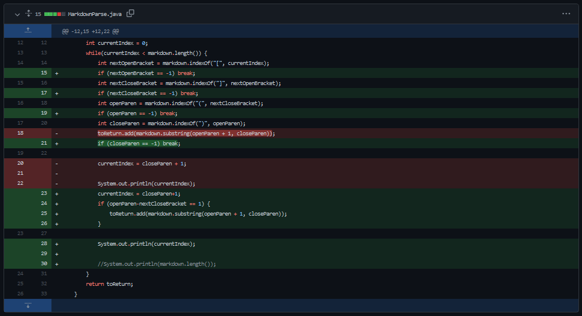

### Lab Report 2
**Three changes to the markdown parser to better implementation.**

1. [Change 1: Infinite Loops](#1)
2. [Change 2: Text Inbetween](#2)
3. [STILL NEED!!!!](#3)

---

##  Change 1: Infinite Loops

#### [Failure Inducing Input](https://nisharu3.github.io/cse15l-lab-reports/failure1.html)

## symptom

- For this, visit the [VScode website](https://code.visualstudio.com/) and download the application for your respective system
- Once the app is installed, open it up. Travel to your home CSE 15L directory, and open that folder.
- To start doing further commands, open the terminal from the menu bar.

---
Back to the [homepage](https://nisharu3.github.io/cse15l-lab-reports/)