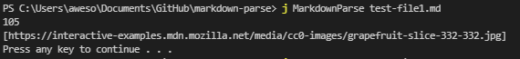

### Lab Report 2
**Three changes to the markdown parser to create better implementation.**

1. [Change 1: Infinite Loops](#1)
2. [Change 2: Text Inbetween](#2)
3. [Change 3: Images](#3)

---

##  Change 1: Infinite Loops

- #### [Failure Inducing Input](https://nisharu3.github.io/cse15l-lab-reports/failure1.html)

- #### Symptoms
    

- The failure inducing input has a error in the markdown file link format. There is no ending to the last link, which causes an infinite loop in the while loop. That is seen in the symptom. To fix this, a series of if statements ending the search when the next necessary element isn't found was introduced.

##  Change 2: Text Inbetween

- #### [Failure Inducing Input](https://nisharu3.github.io/cse15l-lab-reports/failure2.html)

- #### Symptoms
    

- The failure inducing input has text between the link and the url. This is not an actual link anymore, but the symptom shows that it actually does. To fix this, the consecutive placement of the parenthesis and brackets is checked for, for a proper link.

##  Change 3: Images

- #### [Failure Inducing Input](https://nisharu3.github.io/cse15l-lab-reports/failure3.html)

- #### Symptoms
    

- The symptom shows the url of an image in the result of markdown parse. However, this result should not show up, as markdown parse is looking for link URLS. This is due to the exclamation point at the failure inducing file, and accounting for it to ignore images was the solution above.

---
Back to the [homepage](https://nisharu3.github.io/cse15l-lab-reports/)