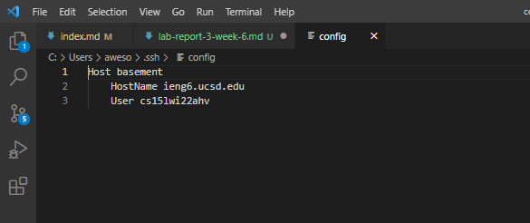
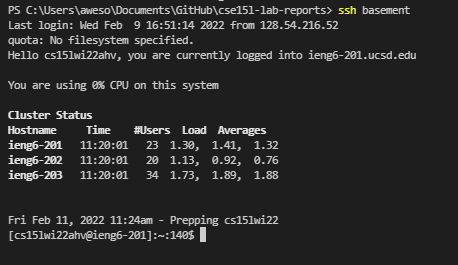
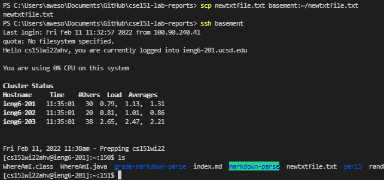

### Lab Report 3
**Streamlining `ssh` configuration**

1. [Making the `config` file](#1)
2. [Using the new `ssh`](#2)
3. [Using `scp` with the new alias](#3)

---

##  Making the `config` file

- This is the `.ssh/config` file, which contains the information that will 
route an alias to the specific server
- The new alias name is after the `Host`, and the login information is provided
as subinformation for that `Host`
- To make this file, find your `.ssh` directory, open a new file from it in an editor such as VSCode,

##  Using the new `ssh`

- Now, one can use the new alias to `ssh` into the server without the large
login name
- This command greatly simplifies the process, and makes any `ssh` processes faster

##  Using `scp` with the new alias

- The new alias can also be used for other server commands, such as `scp`
- The image shows how simple the transfer file process now has become,
as our streamline process has removed the need for a long username and a password altogether.

---
Back to the [homepage](https://nisharu3.github.io/cse15l-lab-reports/)