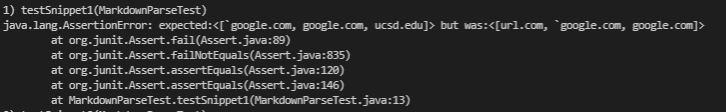

### Lab Report 4
**`MarkdownParse.java` Comparisons**

1. [Group Links](#1)
2. [Snippet #1](#2)
3. [Snippet #2](#3)
4. [Snippet #3](#4)

---

##  Group Links

[Our Group](https://github.com/eNebulas/markdown-parse)

[Their Group](https://github.com/mBookUCSD/markdown-parse)

##  Snippet #1

*The Snippet Preview*

*The `MarkdownParseTest.java` method*

*Our group's results*

*Their results*

*Code Change Follow Up*
Snippet 1 deals with inline code that contains backticks. This change would not require massive changes in the code since there are only a couple additional if-statements needed. Looking into the brackets and parenthesis finders to account for excess special characters is not that hard.

##  Snippet #2

*The Snippet Preview*

*The `MarkdownParseTest.java` method*

*Our group's results*

*Their results*

*Code Change Follow Up*
Snippet 3 deals with nested parenthesis, brackets, and escaped brackets. This code change is much more intensive because the testing for each of these requires a stack of open and close situations that is accurately defined. This would need new loops, if statements, and/or data structures altogether.

##  Snippet #3

*The Snippet Preview*

*The `MarkdownParseTest.java` method*

*Our group's results*

*Their results*

*Code Change Follow Up*
Snippet 3 deals with new lines within bracket and parenthesis pairs. This is once again a heavily involved change because new lines require things to be saved in a similar way to nested pairs. The new lines introduce a different way to scrubbing through the file that isn't currently implemented.

---
Back to the [homepage](https://nisharu3.github.io/cse15l-lab-reports/)