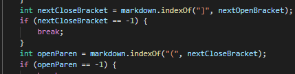

### Lab Report 5
**CommonMark Test Differences**

1. [Testing the Diffs](#1)
2. [Test #1](#2)
3. [Test #2](#3)

---

##  Testing the Diffs

*Implementing Testing Scripts in `script.sh`*

- `for` loops through all `.md` files
- `echo` prints file name
- `java` runs the MarkdownParse file for each file

*Running the scripts to get the outputs*

- `bash` runs script with shell
- `> results.txt` inserts the printed statements into a txt file

*Comparing the two markdown-parse directories*

- Prints out all the differences in the file
- Allows tests with differences to be found!

*Implementing Testing Scripts in `script.sh`*

##  Test #1

**194.md**

*The outputs: Joe's MarkdownParse vs Our MarkdownParse*

*The Results*

- Using the `194.md` file, we can see that the actual resulting URL should be `my_(url)`
- This result shows up in neither Joe's or our implmentation of `MarkdownParse.java`
- In our implementation, the issue with the code is how the parser looks at the space between the brackets and parenthesis
- This bug exists in the following location: 

- By implementing more defined parsing between these two individual link parts, the true result could be found

##  Test #2

**488.md**

*The outputs: Joe's MarkdownParse vs Our MarkdownParse*

*The Results*

- Using the `864.md` file, we can see that the actual resulting URL should be `my url`
- This result shows up in neither Joe's or our implmentation of `MarkdownParse.java`
- In our implementation, the issue with the code is how the parser succintly presents the link in the parenthesis. The tag needs to be broken down into its basic form, yet neither MarkdownParse does that.
- This bug exists in the following location: 

- By creating a new implementation of adding links that filters the results, this could be fixed

---
Back to the [homepage](https://nisharu3.github.io/cse15l-lab-reports/)